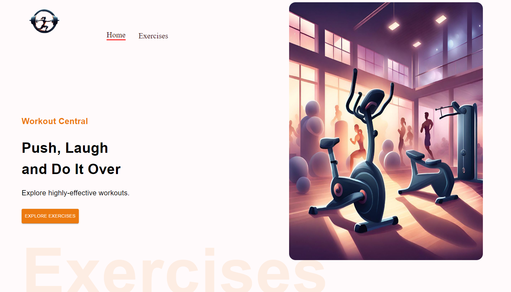
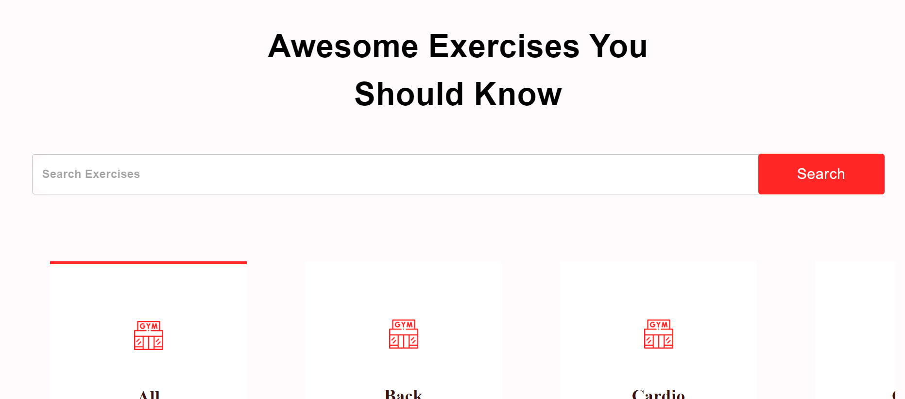
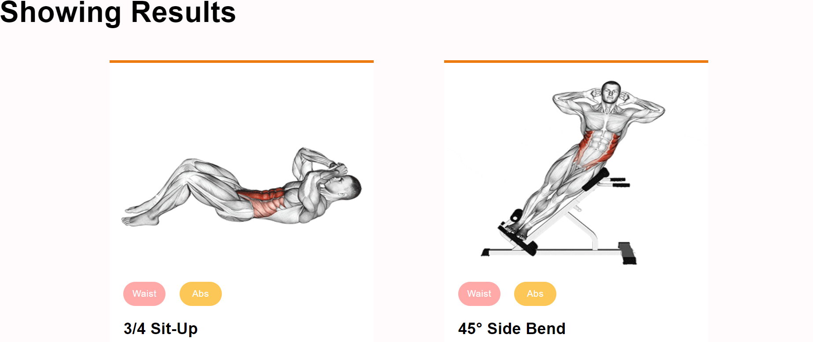
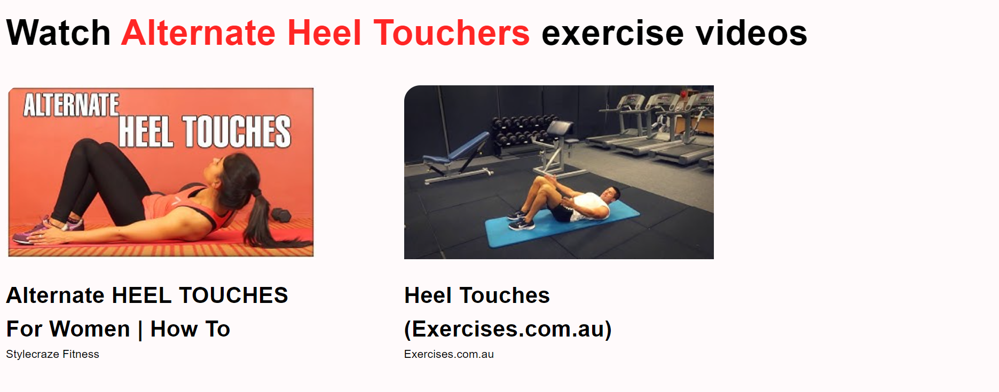

# GymGenius

GymGenius is a web application that allows users to search for exercises based on specific criteria such as cardio, upper body, and more. Users can view detailed information about each exercise and discover similar exercises.

## Features

- **Exercise Search:**
  - Search for exercises based on various criteria, including cardio, upper body, and more.


- **Exercise Details:**
  - View detailed information about each exercise, including target muscles, equipment required, and instructions.

- **Exercise Videos:**
  - Watch videos related to each exercise fetched from YouTube to ensure proper form and technique.

- **Similar Exercises:**
  - Discover similar exercises based on target muscles and equipment.

## Technologies Used

- **React:** Frontend framework for building the user interface.
- **React Router:** Navigation for the single-page application.
- **Material-UI:** React UI framework for styling components.
- **Rapid API:** Fetching exercise videos.
- **YouTube API:** Fetching exercise-related videos.

## Getting Started

To run the GymGenius app locally, follow these steps:

1. Clone the repository:

   ```bash
   git clone https://github.com/Aneal07/Gymgenuis.git
   cd Gymgenuis

Install dependencies:

bash

npm install
Start the development server:

bash

npm start
Open http://localhost:3000 in your browser to view the app.


Contributing
Contributions are welcome! If you'd like to contribute to GymGenius, please follow these guidelines.

Fork the repository.
Create a new branch: git checkout -b feature/new-feature.
Make your changes and commit them: git commit -m 'Add new feature'.
Push to the branch: git push origin feature/new-feature.
Submit a pull request.
License
This project is licensed under the MIT License.

Acknowledgments
Special thanks to YouTube API for providing exercise-related videos.
Material-UI for the React UI framework.